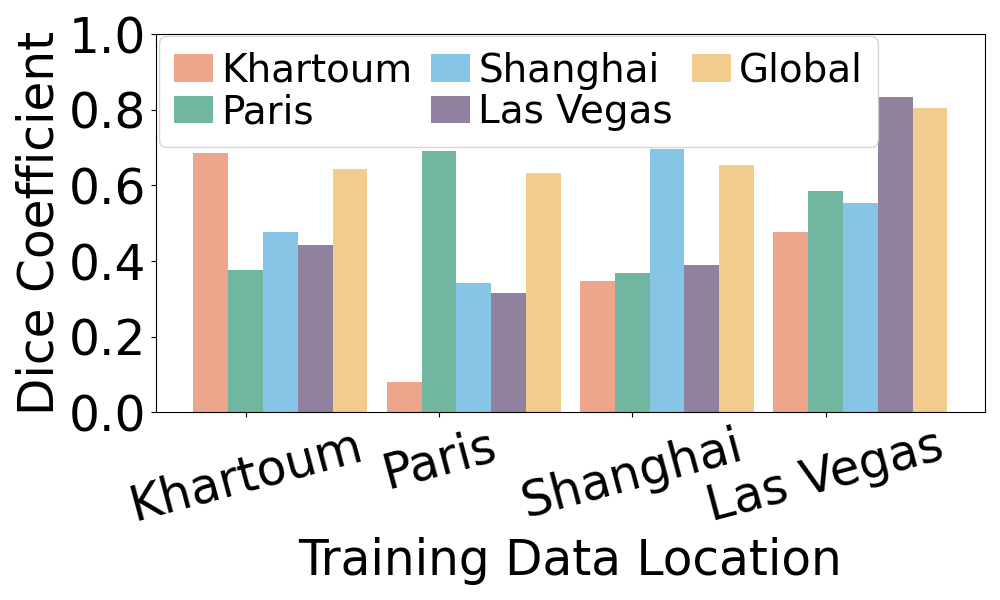
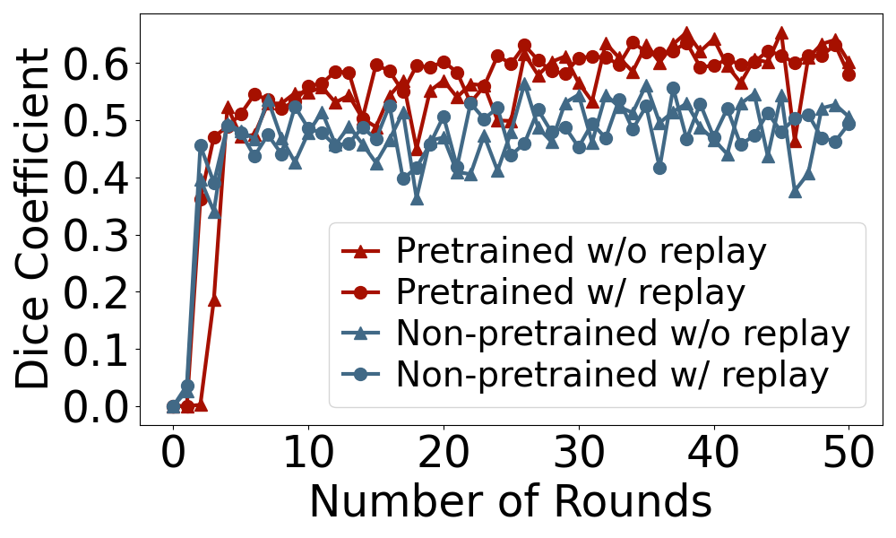

# Data Distribution Drift
This directory contains the data distribution drift data used for plotting Figure 2 in the Percom paper.

## Quick Figure Reproduction
You can quickly reproduce the figure with the pre-generated data provided in this directory.
The pre-generated data is stored in the [eval_results](eval_results) and [training_cache](training_cache) directories.
### Figure 2a

- Open  [plot_location_data_descrepency.ipynb](plot_location_data_descrepency.ipynb).
- Run the code to generate the figure.
- The figure will be saved as `fig2a_unet_location_dice.pdf` in the [figs](./figs) directory. A '.png' version will also be saved in the same directory.
### Figure 2b

- Open  [plot_retraining_eval_results.ipynb](plot_retraining_eval_results.ipynb).
- Run the code to generate the figure.
- The figure will be saved as `fig2b_unet_retrain_dice.pdf` in the [figs](./figs) directory. A '.png' version will also be saved in the same directory.