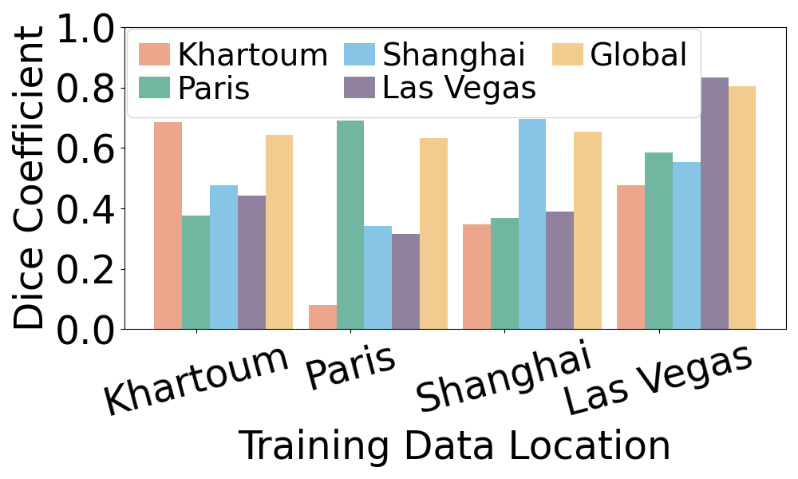
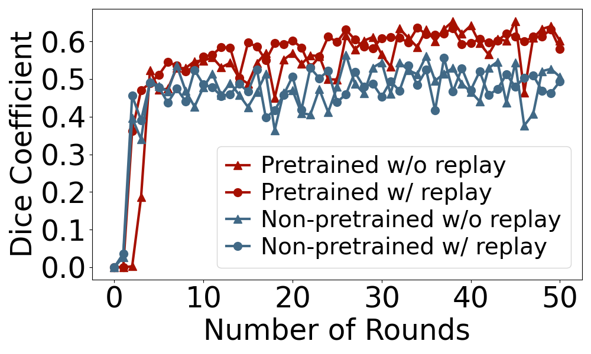

# Data Distribution Drift
This directory contains the data distribution drift data used for plotting Figure 2 in the Percom paper.

## Quick Figure Reproduction
You can quickly reproduce the figure with the pre-generated data provided in this directory.
The pre-generated data is stored in the [eval_results](eval_results) and [training_cache](training_cache) directories.
### Figure 2a

- Open  [plot_location_data_descrepency.ipynb](plot_location_data_descrepency.ipynb).
- Run the code to generate the figure.
- The figure will be saved as `fig2a_unet_location_dice.pdf` in the [figs](./figs) directory. A '.png' version will also be saved in the same directory.
### Figure 2b

- Open  [plot_retraining_eval_results.ipynb](plot_retraining_eval_results.ipynb).
- Run the code to generate the figure.
- The figure will be saved as `fig2b_unet_retrain_dice.pdf` in the [figs](./figs) directory. A '.png' version will also be saved in the same directory.

## Reproduce the Data
### Preparation
- Go to the [Prune_U-Net](Prune_U-Net) folder.
    ```bash
    cd Prune_U-Net
    ```
- Download the model weights from [OneDrive](https://1drv.ms/u/c/96ae991c9e262838/EULEh1Sis8tIks4UEy7t7doB-W4wwKn8-R6ejWvPNkdrIA?e=71ONCX) and place them in the [Prune_U-Net](Prune_U-Net) folder.
- Extract the model weights.
    ```bash
    unzip checkpoint.zip
    ```
- Download the archieved model adaption dataset (extracted from SpaceNet2 dataset) from [OneDrive](https://1drv.ms/u/c/96ae991c9e262838/EYwm2eJGYcVCl0ndEwUXm1ABoJKmO6aDWSrAZu1XdTrjJg?e=tvL3tK) and place it in the [Prune_U-Net](Prune_U-Net) folder.
- Extract the dataset.
    ```bash
    tar -xvf model_adaption_dataset.tar.gz
    ```
### Evaluation
- Run the [eval_locations.py](Prune_U-Net/eval_locations.py) script to generate the data for Figure 2a.
    ```bash
    python eval_locations.py
    ```
- The evaluation results will be saved in the [eval_results](eval_results) directory.
- Move the evaluation results to the [eval_results](eval_results) directory.
    ```bash
    mv eval_results/* ../eval_results/
    ```

