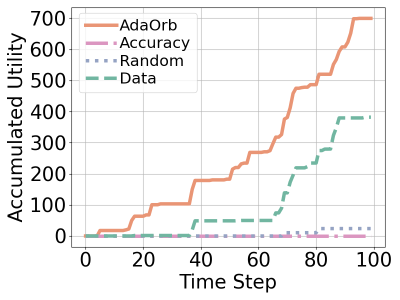
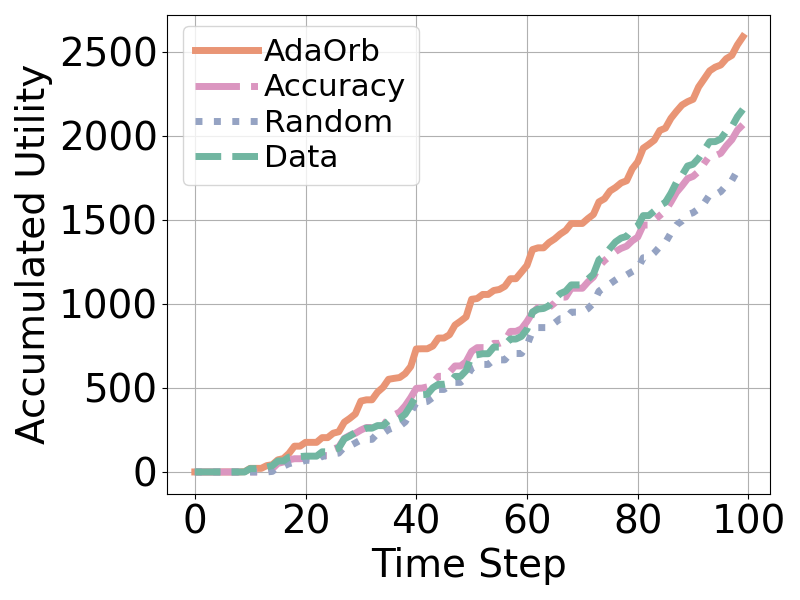

# OEC Model Retraining Task Scheduling Simulator

## Pre-requisites
- Python 3.8+ with matplotlib and Jupyter Notebook installed.

## Quick Figure Reproduction
You can quickly reproduce the figures in the paper by running the provided Jupyter notebooks with our pre-generated data. All the pre-generated data is stored in the `pre_generated_data` folder.
### Figure 5(a)

- Open [plot_utility_sentinel2_sentinel_fig5a.ipynb](plot_utility_sentinel2_sentinel_fig5a.ipynb) in Jupyter Notebook.
- Run the notebook to reproduce the figure.
- The generated figure will be saved at 'figs/sentinel2/sentinel/fig5a_accumulated_utility_over_time_sentinel2_sentinel.pdf', a '.png' version will also be saved for visualization.
### Figure 5(b)

- Open [plot_utility_starlink_fig5b.ipynb](plot_utility_starlink_fig5b.ipynb) in Jupyter Notebook.
- Run the notebook to reproduce the figure.
- The generated figure will be saved at 'figs/starlink/top10/fig5b_accumulated_utility_over_time_starlink_top10.pdf', a '.png' version will also be saved for visualization.
### Figure 6(a)

- Open [plot_prediction_horizon_fig6a.ipynb](plot_prediction_horizon_fig6a.ipynb) in Jupyter Notebook.
- Run the notebook to reproduce the figure.
- The generated figure will be saved at 'figs/prediction_horizon/fig6a_prediction_horizon_utility_subplots.pdf', a '.png' version will also be saved for visualization.

## Simulation
You can also reproduce the data used in the paper by running the provided Python scripts.
### Prepare Data
- Download the archived dataset file `location_evaluation_dataset.zip` from [OneDrive](https://1drv.ms/u/s!Aqz0b2g3x5r8gYt4vX6k7Qw9fJm2?e=GZc0aE) to the current folder.
- Extract the dataset with
```bash
unzip location_evaluation_dataset.zip
```
### Run Simulation
It is highly recommand to use tools like `tmux` or `screen` to run the simulation in the background.
It takes about 2 hours to finish the simulation in our Desktop with Intel Core i9-9900K CPU and 64GB RAM.
- Run simulation for utility experiment (Figure 5(a) and Figure 5(b))
```bash
bash run_utility_simulation.sh
```
- Run simulation for prediction horizon experiment (Figure 6(a))
```bash
bash run_prediction_horizon_simulation.sh
```
Simulation results will be saved in the [data](data) folder.
### Plot Figures
#### Figure 5(a)
- Open [plot_utility_sentinel2_sentinel_fig5a.ipynb](plot_utility_sentinel2_sentinel_fig5a.ipynb) in Jupyter Notebook.
- Change the `data_root` variable in the second block of the notebook to the path of the `data` folder.
- Run the notebook to reproduce the figure.
- The generated figure will be saved at 'figs/sentinel2/sentinel/fig5a_accumulated_utility_over_time_sentinel2_sentinel.pdf', a '.png' version will also be saved for visualization.
#### Figure 5(b)
- Open [plot_utility_starlink_fig5b.ipynb](plot_utility_starlink_fig5b.ipynb) in Jupyter Notebook.
- Change the `data_root` variable in the second block of the notebook to the path of the `data` folder.
- Run the notebook to reproduce the figure.
- The generated figure will be saved at 'figs/starlink/top10/fig5b_accumulated_utility_over_time_starlink_top10.pdf', a '.png' version will also be saved for visualization.
#### Figure 6(a)
- Open [plot_prediction_horizon_fig6a.ipynb](plot_prediction_horizon_fig6a.ipynb) in Jupyter Notebook.
- Change the `data_root` variable in the second block of the notebook to the path of the `data` folder.
- Run the notebook to reproduce the figure.
- The generated figure will be saved at 'figs/prediction_horizon/fig6a_prediction_horizon_utility_subplots.pdf', a '.png' version will also be saved for visualization.


