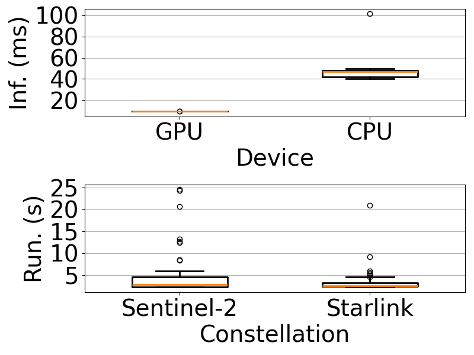

# Algorithm and Model Running time
This directory contains the code to plot the algorithm and model running time (Figure 6(b) in the paper).
We have provided the pre-generated data at [constellation_running_time_list_dict.json](constellation_running_time_list_dict.json) and [device_average_inference_time_list_dict.json](device_average_inference_time_list_dict.json).

## Pre-requisites
- Python 3.8 with the following packages:
    - matplotlib
    - numpy

## Reproduce the figure

Open the Jupyter notebook [plot_algorithm_and_model_running_time.ipynb](plot_algorithm_and_model_running_time.ipynb) and run the code cells to generate the plots.
