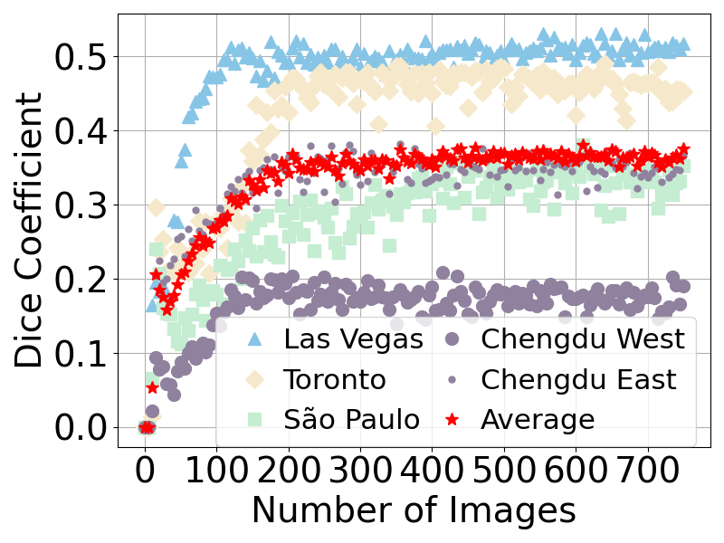
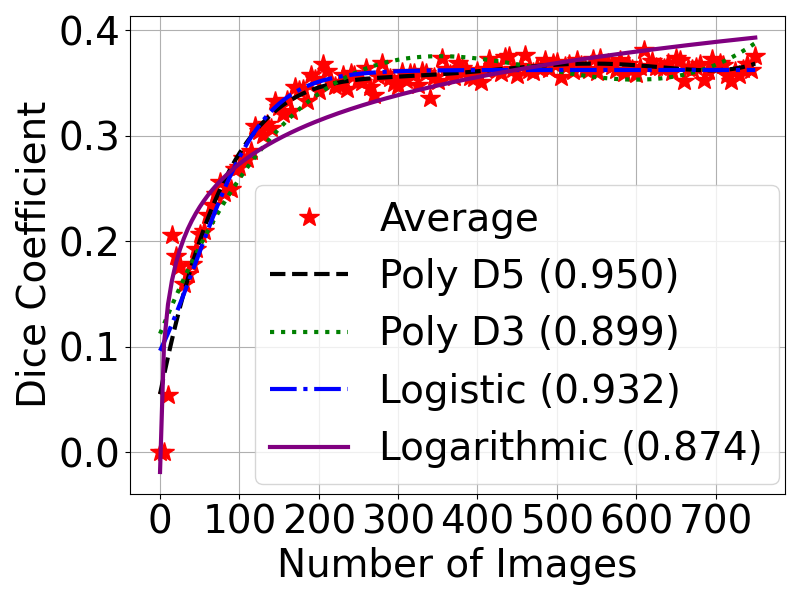

# Profiling Accuracy Function
This directory contains the code for the profiling accuracy function.

## Quick Figure Reproduction
You can quickly reproduce the figure with our pre-generated data in [training_curves.json](training_curves.json) file.
### Pre-requisites
- Python 3.8+ with Jupyter Notebook and the following packages:
    - matplotlib
    - numpy
    - scipy
### Reproduce Figures


- Open the Jupyter Notebook `polynomial_fit_image_script_fig4.ipynb` in this directory.
- Run the notebook to generate the figures.
- The figures will be saved in the current directory as [fig_4a_training_curves.pdf](fig_4a_training_curves.pdf) and [fig_4b_polynomial_fit_multiple_lines.pdf](fig_4b_polynomial_fit_multiple_lines.pdf). A '.png' version of the figures is also available for quick viewing.

## Reproduce Data
### Download dataset
- Download the archived dataset file `location_bootstrap_datasets.zip` from [Onedrive](https://1drv.ms/u/s!Aq2g0rj4xX3WgYt7b5c6z9v8fJdQ?e=Gk0ZlD).
- Extract the dataset file to the current directory.
    ```bash
    unzip location_bootstrap_datasets.zip
    ```
### Generate training curves
It is recommended to use tools like `tmux` or `screen` to run the script in the background.
- Run the script `generate_training_curves.py` to generate the training curves.
    ```bash
    bash run.sh
    ```
