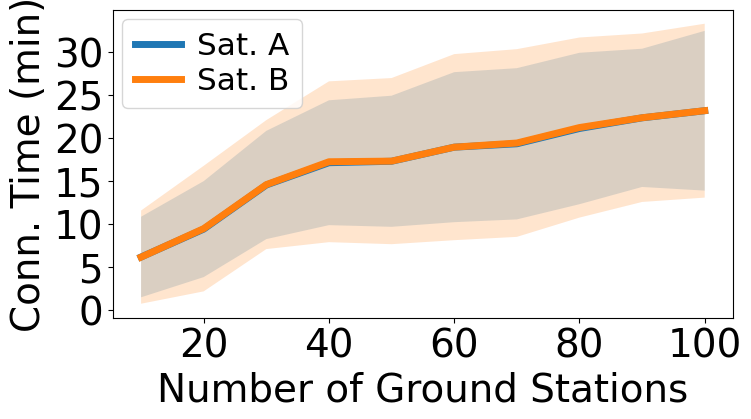
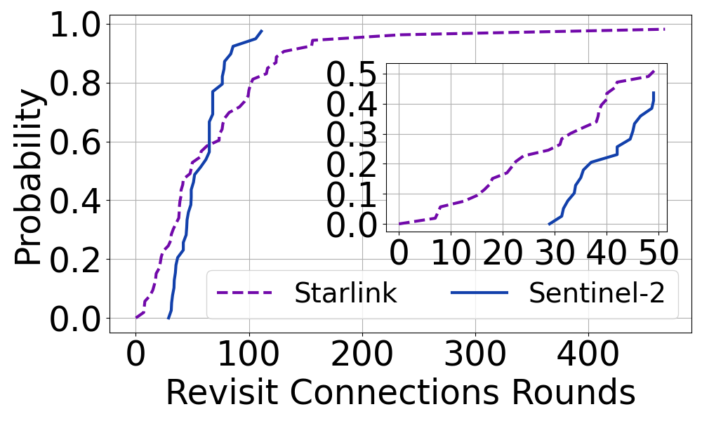

# Satellite Movement Trace
This directory contains the satellite movement trace data used for plotting Figure 1 in the Percom paper.  
We have prepared pre-generated satellite trace data from the [Hypatia LEO Simulator](https://github.com/snkas/hypatia) to save time for satellite trace generation.
You can refer to our Data Generation section for more details on how to generate the satellite trace data.

## Figure Reproduction
### Figure 1a 

- Open `plot_fig1a_conn_time_num_gs.py` and run the code.
- Run the code to generate the figure.
- The figure will be saved as `fig1a_conn_time_num_gs.pdf` in the [figures](./figures) directory. A '.png' version will also be saved in the same directory.
### Figure 1b

- Open `plot_fig1b_revisit_connection_round.py` and run the code.
- Run the code to generate the figure.
- The figure will be saved as `fig1b_connection_round_cdf.pdf` in the [figures](./figures) directory. A '.png' version will also be saved in the same directory.

